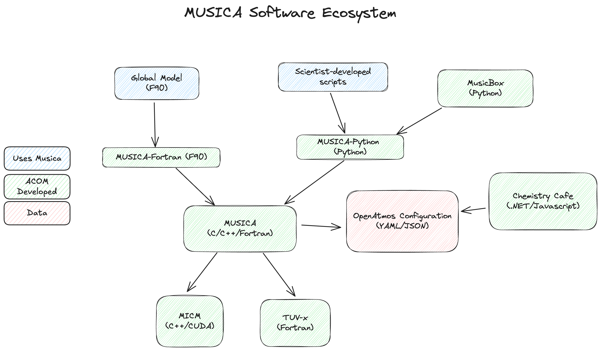

# MUSICA
[](https://github.com/NCAR/musica/releases)
[](https://github.com/NCAR/musica/blob/main/LICENSE)
[](https://github.com/NCAR/musica/actions/workflows/docker.yml)
[](https://github.com/NCAR/musica/actions/workflows/mac.yml)
[](https://github.com/NCAR/musica/actions/workflows/ubuntu.yml)
[](https://github.com/NCAR/musica/actions/workflows/windows.yml)
[](https://github.com/NCAR/musica/actions/workflows/python-tests.yml)
[](https://zenodo.org/doi/10.5281/zenodo.7458559)
[](https://pypi.org/p/musica)
[](https://fairsoftwarechecklist.net/v0.2?f=31&a=32113&i=22322&r=123)
[](https://codecov.io/gh/NCAR/musica)
[](https://mybinder.org/v2/gh/NCAR/musica/HEAD?filepath=tutorials)


Multi-Scale Infrastructure for Chemistry and Aerosols

MUSICA is a collection of modeling software, tools, and grids, that
allow for robust modeling of chemistry in Earth's atmosphere.

At present the project encompasses these core components
- [TUV-x](https://github.com/NCAR/tuv-x)
    - A photolysis rate calculator 

- [MICM](https://github.com/NCAR/micm)
    - Model Independent Chemical Module

- [CARMA](https://github.com/ESCOMP/CARMA)
    - Community Aerosol and Radiation Model for Atmospheres (integration in development)

- [Mechanism Configuration](https://github.com/NCAR/MechanismConfiguration)
    - The standardized format to describe atmospheric chemistry

These components are used to drive the MUSICA software ecosystem. This is a snapshot of how MUSICA can be used with different
models.



# Installation
MUSICA is installable via pip for Python or CMake for C++. 

## Pip
```
pip install musica
```

If you would like GPU support, you must first [add the NVIDIA pypi index](https://docs.nvidia.com/cuda/cuda-quick-start-guide/#pip-wheels-linux) and then you can specify the gpu install option for MUSICA. Note that GPU support has only been tested on linux.

```
pip install --upgrade setuptools pip wheel
pip install nvidia-pyindex
pip install musica[gpu]
```

To build the package locally,

```
pip install -e .
```

If you have an NVIDIA GPU and cuda installed, you can enable a build of musica with GPU support by setting the environment 
variable `BUILD_GPU`.

```
BUILD_GPU=1 pip install -e .
```

## CMake
```
$ git clone https://github.com/NCAR/musica.git
$ cd musica
$ mkdir build
$ cd build
$ ccmake ..
$ make
$ make install
```

# Using the MUSICA Python API
MUSICA makes its chemical mechanism analysis and visualization available through a Python API. The following example works through solving a simple chemistry system. Please refer to the [official documentation](https://ncar.github.io/musica/index.html) for further tutorials and examples.
```python
# --- Import Musica ---
import musica
import musica.mechanism_configuration as mc

# --- 1. Define the chemical system of interest ---
A = mc.Species(name="A")
B = mc.Species(name="B")
C = mc.Species(name="C")
species = [A, B, C]
gas = mc.Phase(name="gas", species=species)

# --- 2. Define a mechanism of interest ---
# Through Musica, several different mechanisms can be explored to define reaction rates. Here, we use the Arrhenius equation as a simple example.

r1 = mc.Arrhenius(name="A->B", A=4.0e-3, C=50, reactants=[A], products=[B], gas_phase=gas)
r2 = mc.Arrhenius(name="B->C", A=1.2e-4, B=2.5, C=75, D=50, E=0.5, reactants=[B], products=[C], gas_phase=gas)

mechanism = mc.Mechanism(name="musica_example", species=species, phases=[gas], reactions=[r1, r2])

# --- 3. Create MICM solver ---
# A solver must be initialized with either a configuration file or a mechanism:

solver = musica.MICM(mechanism=mechanism, solver_type=musica.SolverType.rosenbrock_standard_order)

# --- 4. Define environmental conditions ---
temperature=300.0
pressure=101000.0

# --- 5. Create and initialize State ---
# In the model, conditions represent the starting environment for the reactions and are assigned by modifying the state.

state = solver.create_state()
state.set_concentrations({"A": 1.0, "B": 3.0, "C": 5.0})
state.set_conditions(temperature, pressure)

# --- 6. Time parameters ---
time_step = 4  # stepping
sim_length = 20  # total simulation time

# --- (Optional) 7. Save initial state (t=0) for output visualization ---
initial_row = {"time.s": 0.0, "ENV.temperature.K": temperature, "ENV.pressure.Pa": pressure, "ENV.air number density.mol m-3": state.get_conditions()['air_density'][0]}
initial_row.update({f"CONC.{k}.mol m-3": v[0] for k, v in state.get_concentrations().items()})

# --- 8. Solve through time loop only ---
# The following loop simply solves the model per each time step:

curr_time = time_step
while curr_time <= sim_length:
    solver.solve(state, time_step)
    concentrations = state.get_concentrations()
    curr_time += time_step

# --- 9. Solve and create DataFrame ---
# It is likely more useful to solve at each time step and store the associated data:
import pandas as pd

output_data = [] # prepare to store output per time step
output_data.append(initial_row) # save t=0 data

curr_time = time_step
while curr_time <= sim_length:
    solver.solve(state, time_step)
    row = {
        "time.s": curr_time,
        "ENV.temperature.K": state.get_conditions()['temperature'][0],
        "ENV.pressure.Pa": state.get_conditions()['pressure'][0],
        "ENV.air number density.mol m-3": state.get_conditions()['air_density'][0]
    }
    row.update({f"CONC.{k}.mol m-3": v[0] for k, v in state.get_concentrations().items()})
    output_data.append(row)
    curr_time += time_step

df = pd.DataFrame(output_data)
print(df)

# --- 10. Visualize Specific Results ---
import matplotlib.pyplot as plt

df.plot(x='time.s', y=['CONC.A.mol m-3', 'CONC.B.mol m-3', 'CONC.C.mol m-3'], title='Concentration over time', ylabel='Concentration (mol m-3)', xlabel='Time (s)')
plt.show()
```

# Available grids
Pre-made grids for use in MUSICA are available [here](https://wiki.ucar.edu/display/MUSICA/Available+Grids).

## Developer Options

### Specifying dependency versions via parameterization at configure time

Introduced in [Pull Request #124](https://github.com/NCAR/musica/pull/124), it is possible for developers to specify which versions of various dependencies should be used. These options are currently limited to those dependencies managed via `FetchContent`.  This change allows for more easily testing `musica` against changes committed in different repositories and branches.  The environmental variables introduced are outlined in the following table. 

#### CMake Dependency Variables

| Musica Dependency                                      | Repository                | Branch, Tag or Hash|
| ------------------------------------------------------ | --------------------------|--------------------|
| [Google Test](https://github.com/google/googletest.git)| GOOGLETEST_GIT_REPOSITORY | GOOGLETEST_GIT_TAG |
| [MICM](https://github.com/NCAR/micm.git)               | MICM_GIT_REPOSITORY       | MICM_GIT_TAG       | 
| [TUV-X](https://github.com/NCAR/tuv-x.git)             | TUVX_GIT_REPOSITORY       | TUVX_GIT_TAG       |
| [PyBind11](https://github.com/pybind/pybind11)         | PYBIND11_GIT_REPOSITORY   | PYBIND11_GIT_TAG   |
| [Mechanism Configuration](https://github.com/NCAR/MechanismConfiguration.git) | MECH_CONFIG_GIT_REPOSITORY | MECH_CONFIG_GIT_TAG |

#### Example Usage

> The following examples assume the working directory is a `build/` directory inside the `musica` source directory.

Specifying a different version of `tuv-x`, to ensure a change won't break anything.

    $ cmake .. \
        -DTUVX_GIT_REPOSITORY="https://github.com/WardF/tuv-x.git" \
        -DTUVX_GIT_TAG=test-fix

Specifying a specific version of `tuv-x` by has, but using the official repository.

    $ cmake .. \
        -DTUVX_GIT_TAG=a6b2c4d8745

# Contributing

We welcome contributions from the community! Please see our [Contributing Guide](CONTRIBUTING.md) for information on how to get involved.

For a complete list of contributors and authors, see [AUTHORS.md](AUTHORS.md).

# Citations

MUSICA can be cited in at least two ways:

1. **Cite the foundational paper** that defines the vision of the MUSICA software:
    - [Pfister et al., 2020, Bulletin of the American Meteorological Society](https://doi.org/10.1175/BAMS-D-19-0331.1)
    - Use the following BibTeX entry:
      ```
      @Article { acom.software.musica-vision,
          author = "Gabriele G. Pfister and Sebastian D. Eastham and Avelino F. Arellano and Bernard Aumont and Kelley C. Barsanti and Mary C. Barth and Andrew Conley and Nicholas A. Davis and Louisa K. Emmons and Jerome D. Fast and Arlene M. Fiore and Benjamin Gaubert and Steve Goldhaber and Claire Granier and Georg A. Grell and Marc Guevara and Daven K. Henze and Alma Hodzic and Xiaohong Liu and Daniel R. Marsh and John J. Orlando and John M. C. Plane and Lorenzo M. Polvani and Karen H. Rosenlof and Allison L. Steiner and Daniel J. Jacob and Guy P. Brasseur",
          title = "The Multi-Scale Infrastructure for Chemistry and Aerosols (MUSICA)",
          journal = "Bulletin of the American Meteorological Society",
          year = "2020",
          publisher = "American Meteorological Society",
          address = "Boston MA, USA",
          volume = "101",
          number = "10",
          doi = "10.1175/BAMS-D-19-0331.1",
          pages= "E1743 - E1760",
          url = "https://journals.ametsoc.org/view/journals/bams/101/10/bamsD190331.xml"
      }
      ```

2. **Cite the MUSICA software and its evaluation** (MUSICAv0):
    - [Schwantes et al., 2022, Journal of Advances in Modeling Earth Systems](https://doi.org/10.1029/2021MS002889)
    - Use the following BibTeX entry:
      ```
      @Article{acom.software.musica,
          author = {Schwantes, Rebecca H. and Lacey, Forrest G. and Tilmes, Simone and Emmons, Louisa K. and Lauritzen, Peter H. and Walters, Stacy and Callaghan, Patrick and Zarzycki, Colin M. and Barth, Mary C. and Jo, Duseong S. and Bacmeister, Julio T. and Neale, Richard B. and Vitt, Francis and Kluzek, Erik and Roozitalab, Behrooz and Hall, Samuel R. and Ullmann, Kirk and Warneke, Carsten and Peischl, Jeff and Pollack, Ilana B. and Flocke, Frank and Wolfe, Glenn M. and Hanisco, Thomas F. and Keutsch, Frank N. and Kaiser, Jennifer and Bui, Thao Paul V. and Jimenez, Jose L. and Campuzano-Jost, Pedro and Apel, Eric C. and Hornbrook, Rebecca S. and Hills, Alan J. and Yuan, Bin and Wisthaler, Armin},
          title = {Evaluating the Impact of Chemical Complexity and Horizontal Resolution on Tropospheric Ozone Over the Conterminous US With a Global Variable Resolution Chemistry Model},
          journal = {Journal of Advances in Modeling Earth Systems},
          volume = {14},
          number = {6},
          pages = {e2021MS002889},
          doi = {https://doi.org/10.1029/2021MS002889},
          url = {https://agupubs.onlinelibrary.wiley.com/doi/abs/10.1029/2021MS002889},
          eprint = {https://agupubs.onlinelibrary.wiley.com/doi/pdf/10.1029/2021MS002889},
          year = {2022}
      }
      ```